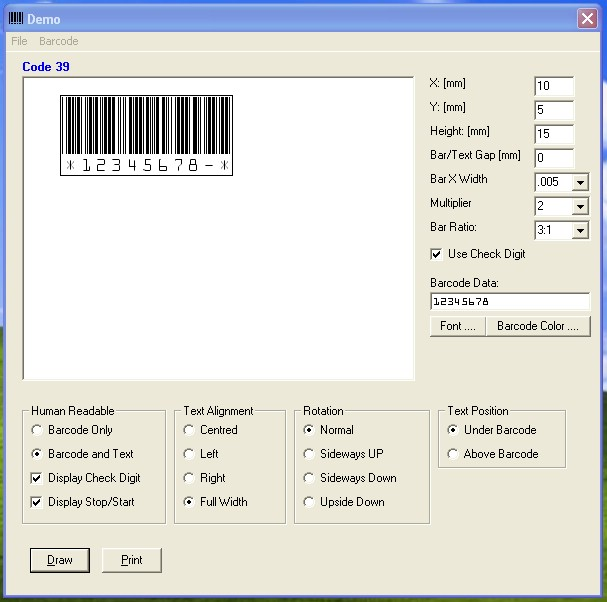

## LinearBarcodes

### Description

Linear Barcodes is the second part to my Bacode submissions. As with the EAN barcodes, this a DLL that programmers and delvelopers can use to add bar-coding functionality to their applications. Just add the reference to the DLL, set a few proporties and you're away. See the document file and demo program for more details on using it. Enjoy. Vote if you like it but would prefer some feed back.
 
### More Info
 

             |
---                |---
**Submitted On**   |2009-04-02 21:58:08
**By**             |[Milton Neal](https://github.com/Planet-Source-Code/PSCIndex/blob/master/ByAuthor/milton-neal.md)
**Level**          |Advanced
**User Rating**    |5.0 (30 globes from 6 users)
**Compatibility**  |VB 6\.0
**Category**       |[Miscellaneous](https://github.com/Planet-Source-Code/PSCIndex/blob/master/ByCategory/miscellaneous__1-1.md)
**World**          |[Visual Basic](https://github.com/Planet-Source-Code/PSCIndex/blob/master/ByWorld/visual-basic.md)
**Archive File**   |[LinearBarc2152715192009\.zip](https://github.com/Planet-Source-Code/milton-neal-linearbarcodes__1-72100/archive/master.zip)

